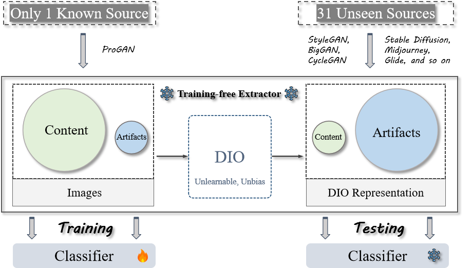
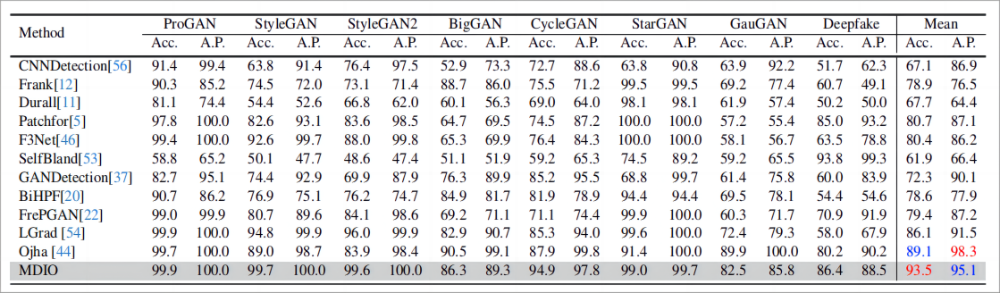
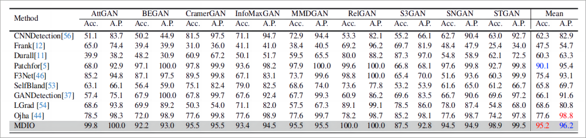
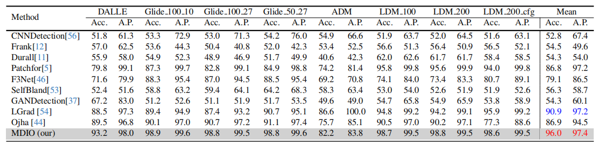
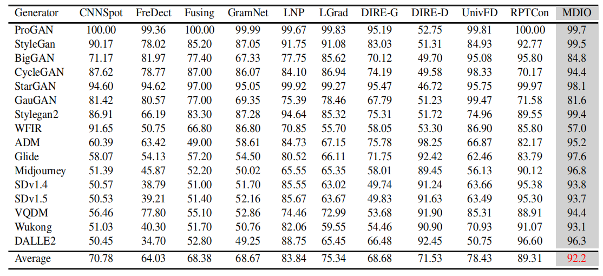

# Data-Independent Operator: A Training-Free Artifact Representation Extractor for Generalizable Deepfake Detection

[Chuangchuang Tan](https://scholar.google.com/citations?user=ufR1PmMAAAAJ&hl=zh-CN), [Yao Zhao](https://scholar.google.com/citations?hl=zh-CN&user=474TbQYAAAAJ), [Guanghua Gu](), [Ping Liu](https://sites.google.com/site/pingliu264/), [Yunchao Wei](https://weiyc.github.io/)

Beijing Jiaotong University, YanShan University, A*Star 

Reference github repository for the paper [Data-Independent Operator: A Training-Free Artifact Representation Extractor for Generalizable Deepfake Detection]().

:star: If Our code is helpful to your images or projects, please help star this repo. Thanks! :hugs:


# **Overall Pipeline**
<p align="center">

</p>


### TODO
- [ ] Pre-Trained Model release
- [ ] Update link to paper and project page  
- [ ] Pretrained models 
- [ ] Dataset download  
- [ ] Code released


# **Detection Results on Various Generators** 
- Results on [ForenSynths Dataset](https://github.com/peterwang512/CNNDetection).
<p align="center">  </p>

- Results on [GANGen-Detection Dataset](https://github.com/chuangchuangtan/GANGen-Detection). [download](https://drive.google.com/drive/folders/11E0Knf9J1qlv2UuTnJSOFUjIIi90czSj?usp=sharing).
<p align="center">  </p>

- Results on [DiffusionForensics Dataset](https://github.com/ZhendongWang6/DIRE).
<p align="center">  </p>

- Results on [UniversalFakeDetect Dataset](https://github.com/Yuheng-Li/UniversalFakeDetect).
<p align="center">  </p>

- Results on [AIGCDetectBenchmark Dataset](https://github.com/Ekko-zn/AIGCDetectBenchmark).
<p align="center">  </p>

## Environment setup
- scipy
- scikit-learn
- numpy
- opencv_python
- Pillow
- torch>=1.2.0
- torchvision
- gdown

```sh
pip install -r requirements.txt
```

## Prepare Dataset
```
chmod 777 ./download_dataset.sh
sh ./download_dataset.sh
```


## Testing the detector
```sh
wget https://lid-1302259812.cos.ap-nanjing.myqcloud.com/tmp/MDIO2github.pth -O MDIO.pth
CUDA_VISIBLE_DEVICES=0 python test.py --model_path ./MDIO.pth --batch_size {BS}
```
<!-- 

-->

## Acknowledgments

This repository borrows partially from the [CNNDetection](https://github.com/peterwang512/CNNDetection).
